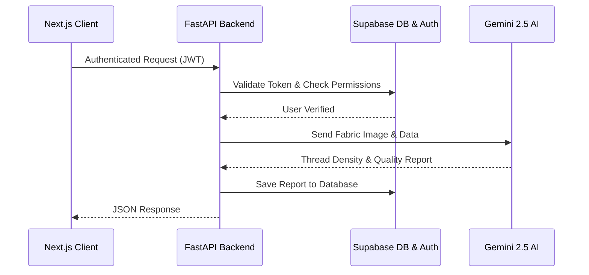

# ThreadCounty API Reference

**Version:** 1.0.0

**Description:** Complete REST API documentation for the ThreadCounty Fabric Analysis Platform. Includes all authentication, AI processing, reporting, and administrative endpoints.

## System Architecture Data Flow

## General Endpoints

---

### `GET` /
**Summary:** Read Root

**Responses:**
| Code | Description |
|------|-------------|
| `200` | Successful Response |

 

### `GET` /api/health
**Summary:** Health Check

**Responses:**
| Code | Description |
|------|-------------|
| `200` | Successful Response |

 

### `POST` /api/chat
**Summary:** Chatbot Chat

**Parameters:**
| Name | In | Required | Type | Description |
|------|----|----------|------|-------------|
| `authorization` | header | No | `string` |  |

**Responses:**
| Code | Description |
|------|-------------|
| `200` | Successful Response |
| `422` | Validation Error |

 

### `GET` /api/users/me
**Summary:** Get Me

**Parameters:**
| Name | In | Required | Type | Description |
|------|----|----------|------|-------------|
| `authorization` | header | No | `string` |  |

**Responses:**
| Code | Description |
|------|-------------|
| `200` | Successful Response |
| `422` | Validation Error |

 

### `DELETE` /api/users/me
**Summary:** Delete My Account

**Parameters:**
| Name | In | Required | Type | Description |
|------|----|----------|------|-------------|
| `authorization` | header | No | `string` |  |

**Responses:**
| Code | Description |
|------|-------------|
| `200` | Successful Response |
| `422` | Validation Error |

 

### `PUT` /api/users/profile
**Summary:** Update User Profile

**Parameters:**
| Name | In | Required | Type | Description |
|------|----|----------|------|-------------|
| `authorization` | header | No | `string` |  |

**Responses:**
| Code | Description |
|------|-------------|
| `200` | Successful Response |
| `422` | Validation Error |

 

### `POST` /api/users/avatar
**Summary:** Upload User Avatar

**Parameters:**
| Name | In | Required | Type | Description |
|------|----|----------|------|-------------|
| `authorization` | header | No | `string` |  |

**Responses:**
| Code | Description |
|------|-------------|
| `200` | Successful Response |
| `422` | Validation Error |

 

### `GET` /api/uploads/quota
**Summary:** Get Quota

**Parameters:**
| Name | In | Required | Type | Description |
|------|----|----------|------|-------------|
| `authorization` | header | No | `string` |  |

**Responses:**
| Code | Description |
|------|-------------|
| `200` | Successful Response |
| `422` | Validation Error |

 

### `POST` /api/uploads
**Summary:** Upload Fabric Image

**Parameters:**
| Name | In | Required | Type | Description |
|------|----|----------|------|-------------|
| `authorization` | header | No | `string` |  |

**Responses:**
| Code | Description |
|------|-------------|
| `200` | Successful Response |
| `422` | Validation Error |

 

### `GET` /api/uploads
**Summary:** List User Uploads

**Parameters:**
| Name | In | Required | Type | Description |
|------|----|----------|------|-------------|
| `status` | query | No | `string` |  |
| `limit` | query | No | `integer` |  |
| `offset` | query | No | `integer` |  |
| `authorization` | header | No | `string` |  |

**Responses:**
| Code | Description |
|------|-------------|
| `200` | Successful Response |
| `422` | Validation Error |

 

### `GET` /api/uploads/{id}
**Summary:** Get User Upload

**Parameters:**
| Name | In | Required | Type | Description |
|------|----|----------|------|-------------|
| `id` | path | Yes | `string` |  |
| `authorization` | header | No | `string` |  |

**Responses:**
| Code | Description |
|------|-------------|
| `200` | Successful Response |
| `422` | Validation Error |

 

### `DELETE` /api/uploads/{id}
**Summary:** Delete User Upload

**Parameters:**
| Name | In | Required | Type | Description |
|------|----|----------|------|-------------|
| `id` | path | Yes | `string` |  |
| `authorization` | header | No | `string` |  |

**Responses:**
| Code | Description |
|------|-------------|
| `200` | Successful Response |
| `422` | Validation Error |

 

### `PUT` /api/uploads/{id}/status
**Summary:** Update Status

**Parameters:**
| Name | In | Required | Type | Description |
|------|----|----------|------|-------------|
| `id` | path | Yes | `string` |  |
| `authorization` | header | No | `string` |  |

**Responses:**
| Code | Description |
|------|-------------|
| `200` | Successful Response |
| `422` | Validation Error |

 

### `POST` /api/reports
**Summary:** Create Fabric Report

**Parameters:**
| Name | In | Required | Type | Description |
|------|----|----------|------|-------------|
| `authorization` | header | No | `string` |  |

**Responses:**
| Code | Description |
|------|-------------|
| `200` | Successful Response |
| `422` | Validation Error |

 

### `GET` /api/reports
**Summary:** List User Reports

**Parameters:**
| Name | In | Required | Type | Description |
|------|----|----------|------|-------------|
| `fabric_type` | query | No | `string` |  |
| `quality_grade` | query | No | `string` |  |
| `limit` | query | No | `integer` |  |
| `offset` | query | No | `integer` |  |
| `authorization` | header | No | `string` |  |

**Responses:**
| Code | Description |
|------|-------------|
| `200` | Successful Response |
| `422` | Validation Error |

 

### `GET` /api/reports/{id}
**Summary:** Get User Report

**Parameters:**
| Name | In | Required | Type | Description |
|------|----|----------|------|-------------|
| `id` | path | Yes | `string` |  |
| `authorization` | header | No | `string` |  |

**Responses:**
| Code | Description |
|------|-------------|
| `200` | Successful Response |
| `422` | Validation Error |

 

### `DELETE` /api/reports/{id}
**Summary:** Delete User Report

**Parameters:**
| Name | In | Required | Type | Description |
|------|----|----------|------|-------------|
| `id` | path | Yes | `string` |  |
| `authorization` | header | No | `string` |  |

**Responses:**
| Code | Description |
|------|-------------|
| `200` | Successful Response |
| `422` | Validation Error |

 

### `GET` /api/reports/{id}/export
**Summary:** Export Report Data

**Parameters:**
| Name | In | Required | Type | Description |
|------|----|----------|------|-------------|
| `id` | path | Yes | `string` |  |
| `authorization` | header | No | `string` |  |

**Responses:**
| Code | Description |
|------|-------------|
| `200` | Successful Response |
| `422` | Validation Error |

 

### `GET` /api/dashboard/stats
**Summary:** Get Dashboard Summary

**Parameters:**
| Name | In | Required | Type | Description |
|------|----|----------|------|-------------|
| `authorization` | header | No | `string` |  |

**Responses:**
| Code | Description |
|------|-------------|
| `200` | Successful Response |
| `422` | Validation Error |

 

### `GET` /api/dashboard/recent
**Summary:** Get Recent Dashboard Reports

**Parameters:**
| Name | In | Required | Type | Description |
|------|----|----------|------|-------------|
| `limit` | query | No | `integer` |  |
| `authorization` | header | No | `string` |  |

**Responses:**
| Code | Description |
|------|-------------|
| `200` | Successful Response |
| `422` | Validation Error |

 

### `GET` /api/dashboard/storage
**Summary:** Get Storage Quota Usage

**Parameters:**
| Name | In | Required | Type | Description |
|------|----|----------|------|-------------|
| `authorization` | header | No | `string` |  |

**Responses:**
| Code | Description |
|------|-------------|
| `200` | Successful Response |
| `422` | Validation Error |

 

### `GET` /api/dashboard/timeline
**Summary:** Get Timeline

**Parameters:**
| Name | In | Required | Type | Description |
|------|----|----------|------|-------------|
| `days` | query | No | `integer` |  |
| `authorization` | header | No | `string` |  |

**Responses:**
| Code | Description |
|------|-------------|
| `200` | Successful Response |
| `422` | Validation Error |

 

### `GET` /api/dashboard/grades
**Summary:** Get Grades

**Parameters:**
| Name | In | Required | Type | Description |
|------|----|----------|------|-------------|
| `authorization` | header | No | `string` |  |

**Responses:**
| Code | Description |
|------|-------------|
| `200` | Successful Response |
| `422` | Validation Error |

 

### `GET` /api/dashboard/fabrics
**Summary:** Get Fabrics

**Parameters:**
| Name | In | Required | Type | Description |
|------|----|----------|------|-------------|
| `authorization` | header | No | `string` |  |

**Responses:**
| Code | Description |
|------|-------------|
| `200` | Successful Response |
| `422` | Validation Error |

 

### `GET` /api/notifications
**Summary:** Get Notifications

**Parameters:**
| Name | In | Required | Type | Description |
|------|----|----------|------|-------------|
| `authorization` | header | No | `string` |  |

**Responses:**
| Code | Description |
|------|-------------|
| `200` | Successful Response |
| `422` | Validation Error |

 

### `PUT` /api/notifications/{id}/read
**Summary:** Mark Read

**Parameters:**
| Name | In | Required | Type | Description |
|------|----|----------|------|-------------|
| `id` | path | Yes | `string` |  |
| `authorization` | header | No | `string` |  |

**Responses:**
| Code | Description |
|------|-------------|
| `200` | Successful Response |
| `422` | Validation Error |

 

### `DELETE` /api/notifications/{id}
**Summary:** Dismiss Notification

**Parameters:**
| Name | In | Required | Type | Description |
|------|----|----------|------|-------------|
| `id` | path | Yes | `string` |  |
| `authorization` | header | No | `string` |  |

**Responses:**
| Code | Description |
|------|-------------|
| `200` | Successful Response |
| `422` | Validation Error |

 

### `POST` /api/notifications/read-all
**Summary:** Mark All Read

**Parameters:**
| Name | In | Required | Type | Description |
|------|----|----------|------|-------------|
| `authorization` | header | No | `string` |  |

**Responses:**
| Code | Description |
|------|-------------|
| `200` | Successful Response |
| `422` | Validation Error |

 

### `POST` /api/contact
**Summary:** Submit Contact

**Parameters:**
| Name | In | Required | Type | Description |
|------|----|----------|------|-------------|
| `authorization` | header | No | `string` |  |

**Responses:**
| Code | Description |
|------|-------------|
| `200` | Successful Response |
| `422` | Validation Error |

 

### `GET` /api/admin/stats
**Summary:** Get Admin Stats

**Parameters:**
| Name | In | Required | Type | Description |
|------|----|----------|------|-------------|
| `authorization` | header | No | `string` |  |

**Responses:**
| Code | Description |
|------|-------------|
| `200` | Successful Response |
| `422` | Validation Error |

 

### `GET` /api/admin/users
**Summary:** Get Users

**Parameters:**
| Name | In | Required | Type | Description |
|------|----|----------|------|-------------|
| `page` | query | No | `integer` |  |
| `limit` | query | No | `integer` |  |
| `search` | query | No | `string` |  |
| `role` | query | No | `string` |  |
| `authorization` | header | No | `string` |  |

**Responses:**
| Code | Description |
|------|-------------|
| `200` | Successful Response |
| `422` | Validation Error |

 

### `GET` /api/admin/users/{id}
**Summary:** Get Admin User Detail

**Parameters:**
| Name | In | Required | Type | Description |
|------|----|----------|------|-------------|
| `id` | path | Yes | `string` |  |
| `authorization` | header | No | `string` |  |

**Responses:**
| Code | Description |
|------|-------------|
| `200` | Successful Response |
| `422` | Validation Error |

 

### `PUT` /api/admin/users/{id}/role
**Summary:** Update Role

**Parameters:**
| Name | In | Required | Type | Description |
|------|----|----------|------|-------------|
| `id` | path | Yes | `string` |  |
| `authorization` | header | No | `string` |  |

**Responses:**
| Code | Description |
|------|-------------|
| `200` | Successful Response |
| `422` | Validation Error |

 

### `PUT` /api/admin/users/{id}/ban
**Summary:** Update Ban

**Parameters:**
| Name | In | Required | Type | Description |
|------|----|----------|------|-------------|
| `id` | path | Yes | `string` |  |
| `authorization` | header | No | `string` |  |

**Responses:**
| Code | Description |
|------|-------------|
| `200` | Successful Response |
| `422` | Validation Error |

 

### `GET` /api/admin/uploads
**Summary:** Get All Admin Uploads

**Parameters:**
| Name | In | Required | Type | Description |
|------|----|----------|------|-------------|
| `page` | query | No | `integer` |  |
| `limit` | query | No | `integer` |  |
| `status` | query | No | `string` |  |
| `authorization` | header | No | `string` |  |

**Responses:**
| Code | Description |
|------|-------------|
| `200` | Successful Response |
| `422` | Validation Error |

 

### `GET` /api/admin/reports
**Summary:** Get All Admin Reports

**Parameters:**
| Name | In | Required | Type | Description |
|------|----|----------|------|-------------|
| `page` | query | No | `integer` |  |
| `limit` | query | No | `integer` |  |
| `quality_grade` | query | No | `string` |  |
| `authorization` | header | No | `string` |  |

**Responses:**
| Code | Description |
|------|-------------|
| `200` | Successful Response |
| `422` | Validation Error |

 

### `GET` /api/admin/contact
**Summary:** Get Contact Messages

**Parameters:**
| Name | In | Required | Type | Description |
|------|----|----------|------|-------------|
| `page` | query | No | `integer` |  |
| `limit` | query | No | `integer` |  |
| `status` | query | No | `string` |  |
| `authorization` | header | No | `string` |  |

**Responses:**
| Code | Description |
|------|-------------|
| `200` | Successful Response |
| `422` | Validation Error |

 

### `PUT` /api/admin/contact/{id}/status
**Summary:** Update Contact Status

**Parameters:**
| Name | In | Required | Type | Description |
|------|----|----------|------|-------------|
| `id` | path | Yes | `string` |  |
| `authorization` | header | No | `string` |  |

**Responses:**
| Code | Description |
|------|-------------|
| `200` | Successful Response |
| `422` | Validation Error |

 

### `POST` /api/admin/notifications/broadcast
**Summary:** Admin Broadcast

**Parameters:**
| Name | In | Required | Type | Description |
|------|----|----------|------|-------------|
| `authorization` | header | No | `string` |  |

**Responses:**
| Code | Description |
|------|-------------|
| `200` | Successful Response |
| `422` | Validation Error |

 

### `DELETE` /api/admin/contact/{id}
**Summary:** Delete Contact Message

**Parameters:**
| Name | In | Required | Type | Description |
|------|----|----------|------|-------------|
| `id` | path | Yes | `string` |  |
| `authorization` | header | No | `string` |  |

**Responses:**
| Code | Description |
|------|-------------|
| `200` | Successful Response |
| `422` | Validation Error |

 

### `DELETE` /api/admin/reports/{id}
**Summary:** Admin Delete Report

**Parameters:**
| Name | In | Required | Type | Description |
|------|----|----------|------|-------------|
| `id` | path | Yes | `string` |  |
| `authorization` | header | No | `string` |  |

**Responses:**
| Code | Description |
|------|-------------|
| `200` | Successful Response |
| `422` | Validation Error |

 

### `DELETE` /api/admin/uploads/{id}
**Summary:** Admin Delete Upload

**Parameters:**
| Name | In | Required | Type | Description |
|------|----|----------|------|-------------|
| `id` | path | Yes | `string` |  |
| `authorization` | header | No | `string` |  |

**Responses:**
| Code | Description |
|------|-------------|
| `200` | Successful Response |
| `422` | Validation Error |

 

### `PUT` /api/admin/users/{user_id}/subscription
**Summary:** Admin Update Subscription

**Parameters:**
| Name | In | Required | Type | Description |
|------|----|----------|------|-------------|
| `user_id` | path | Yes | `string` |  |
| `authorization` | header | No | `string` |  |

**Responses:**
| Code | Description |
|------|-------------|
| `200` | Successful Response |
| `422` | Validation Error |

 

### `GET` /api/blogs
**Summary:** List Blogs

**Parameters:**
| Name | In | Required | Type | Description |
|------|----|----------|------|-------------|
| `published_only` | query | No | `boolean` |  |
| `limit` | query | No | `integer` |  |
| `offset` | query | No | `integer` |  |

**Responses:**
| Code | Description |
|------|-------------|
| `200` | Successful Response |
| `422` | Validation Error |

 

### `POST` /api/blogs
**Summary:** Create Blog

**Parameters:**
| Name | In | Required | Type | Description |
|------|----|----------|------|-------------|
| `authorization` | header | No | `string` |  |

**Responses:**
| Code | Description |
|------|-------------|
| `200` | Successful Response |
| `422` | Validation Error |

 

### `GET` /api/blogs/{slug}
**Summary:** Get Blog

**Parameters:**
| Name | In | Required | Type | Description |
|------|----|----------|------|-------------|
| `slug` | path | Yes | `string` |  |

**Responses:**
| Code | Description |
|------|-------------|
| `200` | Successful Response |
| `422` | Validation Error |

 

### `GET` /api/forums
**Summary:** List Forum Topics

**Parameters:**
| Name | In | Required | Type | Description |
|------|----|----------|------|-------------|
| `category` | query | No | `string` |  |
| `limit` | query | No | `integer` |  |
| `offset` | query | No | `integer` |  |

**Responses:**
| Code | Description |
|------|-------------|
| `200` | Successful Response |
| `422` | Validation Error |

 

### `POST` /api/forums
**Summary:** Create Forum Topic

**Parameters:**
| Name | In | Required | Type | Description |
|------|----|----------|------|-------------|
| `authorization` | header | No | `string` |  |

**Responses:**
| Code | Description |
|------|-------------|
| `200` | Successful Response |
| `422` | Validation Error |

 

### `GET` /api/forums/{topic_id}
**Summary:** Get Forum Topic

**Parameters:**
| Name | In | Required | Type | Description |
|------|----|----------|------|-------------|
| `topic_id` | path | Yes | `string` |  |

**Responses:**
| Code | Description |
|------|-------------|
| `200` | Successful Response |
| `422` | Validation Error |

 

### `GET` /api/forums/{topic_id}/replies
**Summary:** Get Forum Replies

**Parameters:**
| Name | In | Required | Type | Description |
|------|----|----------|------|-------------|
| `topic_id` | path | Yes | `string` |  |
| `limit` | query | No | `integer` |  |
| `offset` | query | No | `integer` |  |

**Responses:**
| Code | Description |
|------|-------------|
| `200` | Successful Response |
| `422` | Validation Error |

 

### `POST` /api/forums/{topic_id}/replies
**Summary:** Create Forum Reply

**Parameters:**
| Name | In | Required | Type | Description |
|------|----|----------|------|-------------|
| `topic_id` | path | Yes | `string` |  |
| `authorization` | header | No | `string` |  |

**Responses:**
| Code | Description |
|------|-------------|
| `200` | Successful Response |
| `422` | Validation Error |

 
