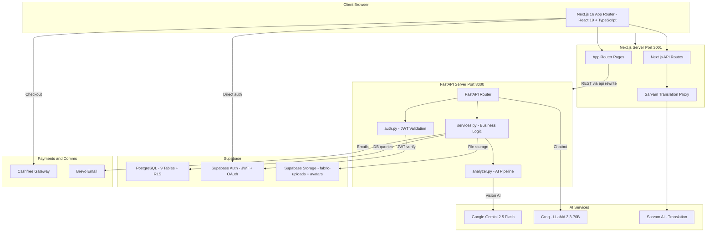
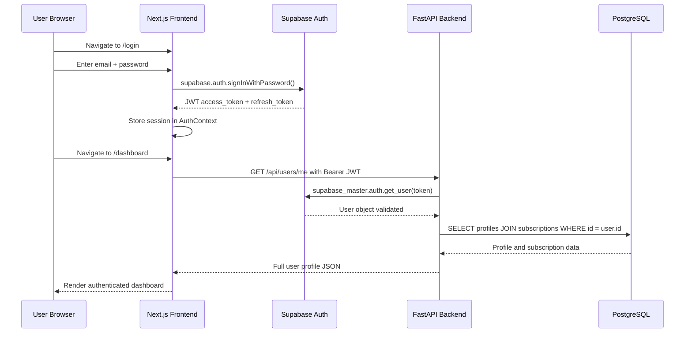
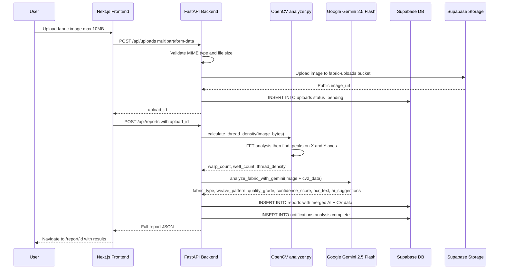
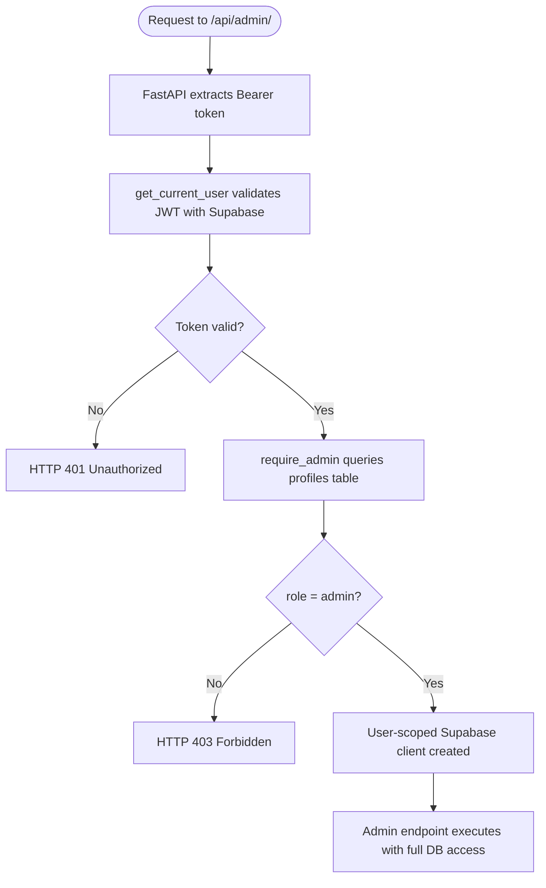
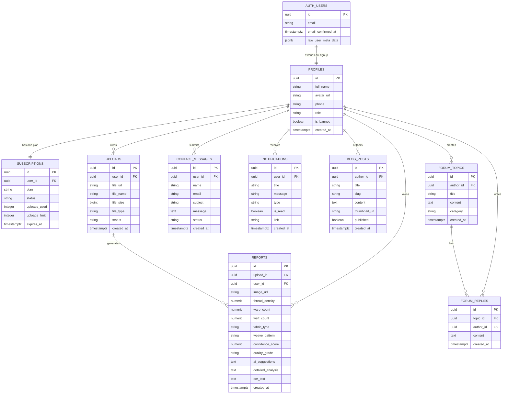
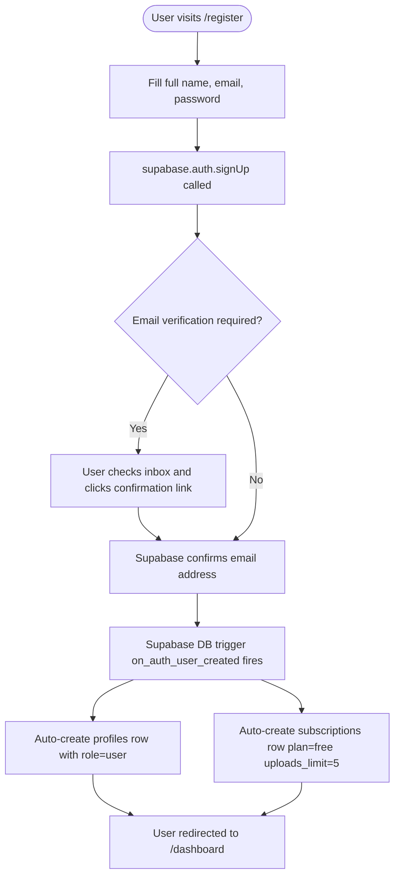
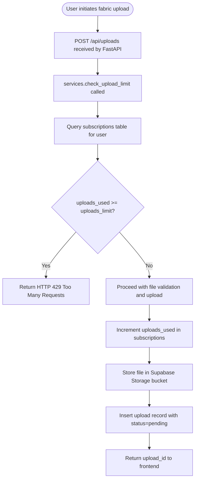

# ThreadCounty - Complete Project Documentation

> **AI-Powered Fabric and Thread Density Analysis Platform**
>
> ThreadCounty is a full-stack SaaS web application that uses Computer Vision and Generative AI to analyze fabric images, detect thread density, classify weave patterns, and generate professional-grade textile quality reports.

---

## Table of Contents

1. [Project Overview](#1-project-overview)
2. [Technology Stack](#2-technology-stack)
3. [System Architecture](#3-system-architecture)
4. [File Structure](#4-file-structure)
5. [Database Schema](#5-database-schema)
6. [Data Flow Diagrams](#6-data-flow-diagrams)
7. [Backend API Reference](#7-backend-api-reference)
8. [Frontend Pages and Routes](#8-frontend-pages-and-routes)
9. [Authentication and Authorization](#9-authentication-and-authorization)
10. [AI Analysis Pipeline](#10-ai-analysis-pipeline)
11. [Subscription and Payment System](#11-subscription-and-payment-system)
12. [Environment Variables](#12-environment-variables)
13. [Running the Project Locally](#13-running-the-project-locally)

---

## 1. Project Overview

ThreadCounty is a multi-tenant SaaS platform targeting textile manufacturers, quality control teams, fashion designers, and researchers. Users upload macro photographs of fabric samples and receive structured AI-generated reports containing:

- **Thread Density** - warp + weft count in Threads Per Inch (TPI)
- **Fabric Type Classification** - Cotton, Silk, Polyester, Denim, Linen, Wool, etc.
- **Weave Pattern Detection** - Plain, Twill, Satin, Basket, etc.
- **Quality Grade** - A+, A, B+, B, C
- **AI Confidence Score** - 0 to 100 percent
- **Microscopic Analysis** - detailed visual breakdown of texture, defects, and structure
- **OCR Label Extraction** - reads brand/composition tags embedded in the image
- **Actionable AI Suggestions** - recommendations for usage or improvement

Reports are stored persistently, viewable in a history timeline, downloadable as PDFs, and comparable side-by-side.

### Key Features

| Feature | Description |
|---|---|
| AI Fabric Analysis | OpenCV FFT + Google Gemini 2.5 Flash vision model |
| Analytics Dashboard | Charts for upload timeline, grade distribution, fabric types |
| AI Chatbot | Groq LLaMA 3.3-70B textile specialist assistant |
| Multi-language | Sarvam AI translates UI to Indian languages |
| Blog System | Admin-published articles with public read access |
| Community Forum | Threaded discussions with categories and replies |
| User Management | Profiles, avatars, subscriptions, banning |
| Admin Panel | Full platform oversight with audit logs |
| Payments | Cashfree payment gateway integration |
| Email | Brevo transactional email service |
| Dark/Light Mode | Theme switching with system preference detection |
| PWA | Progressive Web App with offline support |
| PDF Export | High-quality PDF download of analysis reports |

---

## 2. Technology Stack

### Frontend

| Layer | Technology | Version |
|---|---|---|
| Framework | Next.js App Router | 16.2.9 |
| Language | TypeScript | 5.x |
| Runtime | React | 19.2.4 |
| Styling | Tailwind CSS v4 + Vanilla CSS | v4 |
| UI Components | Shadcn/UI + Base UI | Latest |
| Animations | Framer Motion | 12.x |
| Icons | Lucide React | 1.22 |
| Data Fetching | TanStack Query + Fetch API | 5.x |
| Auth Client | Supabase JS | 2.x |
| Charts | Recharts | 3.x |
| PDF Generation | dom-to-image-more + jsPDF | Latest |
| Fonts | Inter, Space Grotesk, JetBrains Mono | Google Fonts |
| PWA | @ducanh2912/next-pwa | 10.x |

### Backend

| Layer | Technology | Version |
|---|---|---|
| Framework | FastAPI | Latest |
| Language | Python | 3.x |
| Server | Uvicorn ASGI | Latest |
| Database Client | Supabase Python SDK | Latest |
| AI Vision | Google Gemini 2.5 Flash via google-genai | Latest |
| Computer Vision | OpenCV Headless + NumPy + SciPy | Latest |
| LLM Chatbot | Groq API - LLaMA 3.3-70B | Latest |
| Email | Brevo Sendinblue REST API | v3 |
| Env Management | python-dotenv | Latest |

### Infrastructure and Services

| Service | Role |
|---|---|
| **Supabase** | PostgreSQL database, Auth JWT, Storage S3-compatible, Row Level Security |
| **Google Gemini 2.5 Flash** | Multimodal vision AI for fabric classification and analysis |
| **Groq** | Ultra-fast LLM inference for AI chatbot using LLaMA 3.3-70B |
| **Sarvam AI** | English-to-Indic language translation |
| **Cashfree** | Payment gateway for subscription upgrades |
| **Brevo** | Transactional email delivery |

---

## 3. System Architecture

### High-Level Architecture



### Authentication Flow



### Fabric Analysis Request Flow



### Admin Authorization Flow



### PDF Download Flow

```mermaid
flowchart LR
    A([User clicks Download PDF]) --> B[Dynamic import dom-to-image-more]
    B --> C[Dynamic import jsPDF]
    C --> D[Get DOM element id report-content]
    D --> E[domtoimage.toPng scale=2 quality=1.0]
    E --> F[Measure actual pixel dimensions]
    F --> G[Create jsPDF with exact pixel dimensions]
    G --> H[addImage PNG to PDF at full resolution]
    H --> I[pdf.save as ThreadCounty Report ID.pdf]
    I --> J[Toast: Report Downloaded]
```



---

## 4. File Structure

```
Thread/                              Root Monorepo
|
|-- .env.local                       Backend environment variables (git-ignored)
|-- .env.example                     Backend env template (committed to git)
|-- .gitignore                       Root git ignore rules
|-- package.json                     Root scripts: dev, backend, build
|-- DOCUMENTATION.md                 This file
|
|-- backend/                         Python FastAPI Server
|   |-- main.py                      All API route definitions (630+ lines)
|   |-- analyzer.py                  AI pipeline: OpenCV FFT + Gemini
|   |-- services.py                  All Supabase database business logic
|   |-- auth.py                      JWT auth middleware and admin guard
|   `-- requirements.txt             Python pip dependencies
|
|-- supabase/                        Database layer
|   |-- schema.sql                   Full PostgreSQL schema: 9 tables + RLS
|   |-- functions.sql                SQL utility functions
|   `-- fix_rls_recursion.sql        Patch for RLS infinite recursion
|
`-- next-frontend/                   Next.js 16 Application
    |-- .env.local                   Frontend environment variables (git-ignored)
    |-- .env.example                 Frontend env template (committed to git)
    |-- .gitignore                   Frontend git ignore rules
    |-- next.config.ts               Next.js config: rewrites, Turbopack, PWA
    |-- package.json                 Frontend npm dependencies
    |-- tsconfig.json                TypeScript configuration
    |-- public/
    |   |-- logo.jpg                 App favicon and brand logo
    |   |-- manifest.json            PWA manifest
    |   `-- icons/                   PWA icon variants
    |
    `-- src/
        |-- app/                     Next.js App Router
        |   |-- layout.tsx           Root layout: fonts, metadata, theme script
        |   |-- globals.css          Global styles, CSS variables, design tokens
        |   |-- page.tsx             Landing page at /
        |   |-- about/               About page at /about
        |   |-- blog/                Public blog at /blog
        |   |-- contact/             Contact form at /contact
        |   |-- faq/                 FAQ accordion at /faq
        |   |-- pricing/             Pricing plans at /pricing
        |   |-- login/               Auth at /login
        |   |-- register/            Signup at /register
        |   |-- forgot-password/     Password reset request
        |   |-- reset-password/      Token-based password reset
        |   |-- api/translate/       Server-side Sarvam AI proxy route
        |   |
        |   `-- (dashboard)/         Protected route group - requires auth
        |       |-- layout.tsx       Auth guard: redirects to /login if not authed
        |       |-- dashboard/       Main dashboard at /dashboard
        |       |-- upload/          Fabric upload at /upload
        |       |-- history/         History at /history
        |       |-- report/[id]/     Report viewer at /report/:id
        |       |-- compare/         Side-by-side comparison at /compare
        |       |-- analytics/       Analytics at /analytics
        |       |-- chatbot/         AI chatbot at /chatbot
        |       |-- community/       Forum at /community
        |       |-- blog/            In-app blog reader
        |       |-- profile/         Profile editor at /profile
        |       `-- admin/           Admin panel - role=admin required
        |           |-- layout.tsx   Admin sidebar navigation
        |           |-- page.tsx     Admin overview at /admin
        |           |-- users/       User management
        |           |-- uploads/     Upload moderation
        |           |-- reports/     Report oversight
        |           |-- subscriptions/ Subscription management
        |           |-- blogs/       Blog post editor
        |           |-- messages/    Contact message inbox
        |           |-- analytics/   Platform-wide analytics
        |           |-- notifications/ Broadcast notifications
        |           |-- audit-logs/  System audit trail
        |           `-- settings/    Platform settings
        |
        |-- components/
        |   |-- layout/
        |   |   |-- DashboardLayout.tsx  Sidebar + navbar shell for auth pages
        |   |   |-- Navbar.tsx           Public site navigation header
        |   |   |-- Footer.tsx           Public site footer
        |   |   |-- PageLoader.tsx       Full-screen loading animation
        |   |   `-- LanguageSwitcher.tsx Language selection dropdown
        |   |-- ui/                      Shadcn/UI component library
        |   |-- dashboard/               Dashboard chart and stat components
        |   |-- landing/                 Landing page section components
        |   |-- three/                   Three.js 3D fabric visualization
        |   |-- AuthLayout.tsx           Shared login/register page frame
        |   |-- FloatingChatbot.tsx      Persistent floating chatbot widget
        |   |-- SarvamTranslator.tsx     Language translation overlay UI
        |   |-- ThemeToggle.tsx          Dark/light mode toggle button
        |   |-- Providers.tsx            React Query + Theme providers wrapper
        |   `-- UserNotRegisteredError.tsx  OAuth user missing profile error
        |
        `-- lib/
            |-- AuthContext.tsx       Global auth state management via React Context
            |-- apiClient.ts          Fully typed API client for all /api/* calls
            |-- supabaseClient.ts     Supabase browser client singleton
            |-- query-client.ts       TanStack Query client config
            |-- utils.ts              Tailwind cn() class merge utility
            `-- i18n/                 Internationalization translation strings
```

---

## 5. Database Schema

### Entity Relationship Diagram



### Table Summary

| Table | Purpose | RLS Policy |
|---|---|---|
| `profiles` | Extends Supabase auth users with app-level fields | Users CRUD own; admins read all |
| `subscriptions` | One-to-one plan and upload quota per user | Users read own; admins full access |
| `uploads` | Fabric image upload records and processing status | Users CRUD own; admins full access |
| `reports` | AI-generated analysis report data | Users read/delete own; admins full access |
| `contact_messages` | Public contact form submissions | Public insert; users read own; admins full |
| `notifications` | Per-user in-app notification records | Users CRUD own; admins can insert |
| `blog_posts` | Admin-authored published articles | Public read if published; admins write |
| `forum_topics` | Community discussion threads | Auth users read/insert; author or admin edit |
| `forum_replies` | Threaded replies to forum topics | Auth users read/insert; author or admin edit |

### Database Triggers

| Trigger | Table | Action |
|---|---|---|
| `on_auth_user_created` | `auth.users` | Auto-creates a `profiles` row and a `free` subscription when a new user signs up |
| `handle_profiles_updated_at` | `profiles` | Auto-updates `updated_at` timestamp on every row change |
| `handle_subscriptions_updated_at` | `subscriptions` | Same - auto-updates `updated_at` |
| `handle_uploads_updated_at` | `uploads` | Same - auto-updates `updated_at` |
| `handle_reports_updated_at` | `reports` | Same - auto-updates `updated_at` |

### Subscription Plans

| Plan | Upload Limit | Description |
|---|---|---|
| `free` | 5 per period | Default plan assigned automatically on signup |
| `student` | Custom | Discounted educational tier |
| `professional` | Custom | Production use tier |
| `enterprise` | Unlimited | Custom quota for large organizations |

---

## 6. Data Flow Diagrams

### User Registration Flow



### Upload Quota Enforcement



---

## 7. Backend API Reference

**Base URL:** `http://localhost:8000` (development)

All protected endpoints require the header: `Authorization: Bearer <JWT>`

Interactive Swagger docs are auto-generated at: `http://localhost:8000/docs`

### Health

| Method | Endpoint | Auth | Description |
|---|---|---|---|
| GET | `/` | None | Root welcome message |
| GET | `/api/health` | None | Service health status check |

### User Profile

| Method | Endpoint | Auth | Description |
|---|---|---|---|
| GET | `/api/users/me` | User | Get authenticated user profile and subscription |
| PUT | `/api/users/profile` | User | Update full_name and phone |
| POST | `/api/users/avatar` | User | Upload avatar image JPG/PNG max 5MB |
| DELETE | `/api/users/me` | User | Permanently delete own account |

### Uploads

| Method | Endpoint | Auth | Description |
|---|---|---|---|
| GET | `/api/uploads/quota` | User | Get current upload quota and usage |
| POST | `/api/uploads` | User | Upload a fabric image multipart/form-data |
| GET | `/api/uploads` | User | List own uploads with pagination and status filter |
| GET | `/api/uploads/{id}` | User | Get a single upload by UUID |
| PUT | `/api/uploads/{id}/status` | User | Update upload processing status |
| DELETE | `/api/uploads/{id}` | User | Delete an upload and its storage file |

### Reports

| Method | Endpoint | Auth | Description |
|---|---|---|---|
| POST | `/api/reports` | User | Trigger AI analysis and create report from an upload |
| GET | `/api/reports` | User | List own reports with fabric_type and quality_grade filters |
| GET | `/api/reports/{id}` | User | Get a single full report by UUID |
| GET | `/api/reports/{id}/export` | User | Export report as structured JSON |
| DELETE | `/api/reports/{id}` | User | Delete a report |

### Dashboard

| Method | Endpoint | Auth | Description |
|---|---|---|---|
| GET | `/api/dashboard/stats` | User | Summary stats: total uploads, reports, avg confidence |
| GET | `/api/dashboard/recent` | User | Most recent reports list |
| GET | `/api/dashboard/storage` | User | Storage bytes used vs quota |
| GET | `/api/dashboard/timeline` | User | Upload activity over N days default 30 |
| GET | `/api/dashboard/grades` | User | Quality grade distribution for charts |
| GET | `/api/dashboard/fabrics` | User | Fabric type distribution for charts |

### Notifications

| Method | Endpoint | Auth | Description |
|---|---|---|---|
| GET | `/api/notifications` | User | List all user notifications |
| PUT | `/api/notifications/{id}/read` | User | Mark a single notification as read |
| POST | `/api/notifications/read-all` | User | Mark all notifications as read |
| DELETE | `/api/notifications/{id}` | User | Delete a notification |

### Contact

| Method | Endpoint | Auth | Description |
|---|---|---|---|
| POST | `/api/contact` | Optional | Submit contact form - works for guests and logged-in users |

### AI Chatbot

| Method | Endpoint | Auth | Description |
|---|---|---|---|
| POST | `/api/chat` | User | Send chat message to Groq LLaMA 3.3-70B textile chatbot |

### Blog

| Method | Endpoint | Auth | Description |
|---|---|---|---|
| GET | `/api/blogs` | None | List all published blog posts |
| GET | `/api/blogs/{slug}` | None | Get a single blog post by slug |
| POST | `/api/blogs` | Admin | Create a new blog post |

### Community Forum

| Method | Endpoint | Auth | Description |
|---|---|---|---|
| GET | `/api/forums` | None | List all forum topics with optional category filter |
| GET | `/api/forums/{topic_id}` | None | Get a single forum topic |
| POST | `/api/forums` | User | Create a new forum topic |
| GET | `/api/forums/{topic_id}/replies` | None | Get all replies for a topic |
| POST | `/api/forums/{topic_id}/replies` | User | Post a reply to a topic |

### Admin Endpoints (role=admin required)

| Method | Endpoint | Description |
|---|---|---|
| GET | `/api/admin/stats` | Platform-wide statistics and KPIs |
| GET | `/api/admin/users` | List all users with search and role filter |
| GET | `/api/admin/users/{id}` | Get full details for a specific user |
| PUT | `/api/admin/users/{id}/role` | Promote or demote user role |
| PUT | `/api/admin/users/{id}/ban` | Ban or unban a user account |
| PUT | `/api/admin/users/{id}/subscription` | Update a user subscription plan and limit |
| GET | `/api/admin/uploads` | List all uploads across the entire platform |
| DELETE | `/api/admin/uploads/{id}` | Force-delete any upload |
| GET | `/api/admin/reports` | List all reports across the entire platform |
| DELETE | `/api/admin/reports/{id}` | Force-delete any report |
| GET | `/api/admin/contact` | List all contact form submissions |
| PUT | `/api/admin/contact/{id}/status` | Update contact message status to read or replied |
| DELETE | `/api/admin/contact/{id}` | Delete a contact message |
| POST | `/api/admin/notifications/broadcast` | Broadcast a push notification to all platform users |

---

## 8. Frontend Pages and Routes

### Public Routes (no authentication required)

| Route | Page | Description |
|---|---|---|
| `/` | Landing Page | Hero, features showcase, testimonials, call to action |
| `/about` | About | Team, mission statement, technology stack |
| `/blog` | Blog | Public listing of published articles |
| `/blog/[slug]` | Blog Post | Individual article reader |
| `/contact` | Contact | Contact form submitted to backend |
| `/faq` | FAQ | Accordion-style frequently asked questions |
| `/pricing` | Pricing | Subscription plan comparison and upgrade CTA |
| `/login` | Login | Email/password sign-in and Google OAuth |
| `/register` | Register | New user signup form |
| `/forgot-password` | Forgot Password | Send password reset link to email |
| `/reset-password` | Reset Password | Token-based password update form |

### Protected Dashboard Routes (authentication required)

| Route | Page | Key Features |
|---|---|---|
| `/dashboard` | Dashboard | Stats cards, recent reports, grade distribution chart, fabric type chart, activity timeline |
| `/upload` | Upload | Drag-and-drop image upload, upload quota meter, multi-language selector |
| `/history` | History | Paginated list of uploads and reports with status, grade, and type filters |
| `/report/[id]` | Report Viewer | Full AI analysis display, thread metrics, confidence score, PDF download |
| `/compare` | Compare | Side-by-side report comparison view |
| `/analytics` | Analytics | Advanced Recharts visualizations: warp/weft trends, quality radar |
| `/chatbot` | Chatbot | Full chat UI powered by Groq LLaMA 3.3-70B |
| `/community` | Community Forum | Forum topic listing and threaded replies |
| `/profile` | Profile | Edit name, phone, avatar; danger zone for account deletion |

### Admin Routes (role=admin required)

| Route | Page | Description |
|---|---|---|
| `/admin` | Admin Overview | Platform KPIs and quick action cards |
| `/admin/users` | User Management | Search, filter, role change, ban/unban, subscription management |
| `/admin/uploads` | Uploads | Browse, filter, and delete all platform uploads |
| `/admin/reports` | Reports | Browse, filter, and delete all platform reports |
| `/admin/subscriptions` | Subscriptions | View and modify all user subscription plans |
| `/admin/blogs` | Blog Editor | Create and manage blog posts with rich text |
| `/admin/messages` | Messages | Read, update status, and reply to contact submissions |
| `/admin/analytics` | Analytics | Platform-wide aggregated usage analytics |
| `/admin/notifications` | Notifications | Broadcast push notifications to all users |
| `/admin/audit-logs` | Audit Logs | Chronological system action history trail |
| `/admin/settings` | Settings | Platform configuration panel |

---

## 9. Authentication and Authorization

### Dual-Layer Authentication

ThreadCounty uses a dual-layer authentication model:

**Layer 1 - Supabase Auth (Client-side)**

The Next.js frontend uses the Supabase JavaScript SDK (`@supabase/supabase-js`) to manage user sessions via JWT tokens stored in the browser. Session state is held globally via `AuthContext.tsx` which exposes `user`, `isAuthenticated`, `isLoadingAuth`, and auth action methods to all components.

**Layer 2 - FastAPI JWT Validation (Server-side)**

Every API request to the Python backend must include an `Authorization: Bearer <JWT>` header. The `auth.py` module extracts and validates this token by calling `supabase_master.auth.get_user(token)` on every single request. This creates a user-scoped Supabase client so that Row Level Security policies are enforced automatically.

### Role System

| Role | Access Level |
|---|---|
| `user` (default) | Own data only: uploads, reports, profile, notifications |
| `admin` | Full platform access: all user data, all admin API endpoints |

Admin status is enforced at three independent layers:
- **Database** - `profiles.role` column has a `CHECK (role IN ('admin', 'user'))` constraint
- **Backend** - `require_admin` FastAPI dependency queries the `profiles` table and raises HTTP 403 if role is not admin
- **Frontend** - The admin layout component redirects to `/dashboard` if `user.role !== 'admin'`

### Row Level Security (RLS)

All 9 database tables have RLS enabled. The security model follows these patterns:

- **User scope** - `auth.uid() = user_id` ensures users can only access their own rows
- **Admin access** - The `is_admin()` SQL function (security-definer) grants admins full table access
- **Public access** - `contact_messages` INSERT and `blog_posts` SELECT (published only) work without authentication

The `is_admin()` function is defined as a security definer to prevent RLS recursion issues:

```sql
CREATE OR REPLACE FUNCTION public.is_admin()
RETURNS BOOLEAN
LANGUAGE sql SECURITY DEFINER SET search_path = public
AS $$ SELECT EXISTS (
    SELECT 1 FROM profiles WHERE id = auth.uid() AND role = 'admin'
); $$;
```

---

## 10. AI Analysis Pipeline

The fabric analysis pipeline executes in two sequential stages every time `POST /api/reports` is called.

### Stage 1 - Computer Vision Thread Counting (OpenCV + SciPy)

**File:** `backend/analyzer.py` - function `calculate_thread_density(image_bytes)`

The algorithm uses 2D Fast Fourier Transform (FFT) to detect periodic patterns in the fabric weave:

1. Decode raw image bytes with `cv2.imdecode` and convert to grayscale
2. Apply `numpy.fft.fft2` to transform the image into the frequency domain
3. Shift the zero-frequency component to the center with `numpy.fft.fftshift`
4. Compute the log-magnitude spectrum in decibels
5. Project the 2D spectrum onto two 1D signals by averaging horizontal and vertical center slices
6. Use `scipy.signal.find_peaks` with prominence filtering to detect dominant frequency peaks in each axis
7. Extract the minimum distance from center to avoid DC component noise
8. Apply a 300 DPI assumption to convert spatial frequency (cycles/pixel) to Threads Per Inch
9. Clamp results to realistic range of 10-300 TPI; fallback to 45/35 TPI if no peaks are detected

**Output:** `{ "warp_count": int, "weft_count": int, "thread_density": int }`

### Stage 2 - Generative Vision AI (Google Gemini 2.5 Flash)

**File:** `backend/analyzer.py` - function `analyze_fabric_with_gemini(image_bytes, cv2_data, mime_type, language)`

1. Constructs a structured JSON-schema prompt that embeds the OpenCV thread measurements
2. Sends raw image bytes as multimodal input alongside the text prompt to `gemini-2.5-flash`
3. Requests `response_mime_type="application/json"` to get clean parseable structured output
4. Parses the Gemini JSON response containing classification and analysis fields
5. Merges Gemini's classifications with OpenCV's precise numeric thread counts
6. Supports multi-language output by including an ISO language code in the prompt (e.g., `"hi"` for Hindi)

**Output:** `{ "fabric_type", "weave_pattern", "confidence_score", "quality_grade", "ocr_text", "ai_suggestions", "detailed_analysis" }`

### Fallback Mechanism

If `GEMINI_API_KEY` is not set or the Gemini API call fails, `get_mock_analysis()` returns clearly labelled fallback data. This keeps the entire application functional during development without API keys configured.

### AI Prompt Structure

The prompt sent to Gemini is a structured instruction that:
- Provides the OpenCV-computed thread density numbers as context
- Asks Gemini to validate and enhance these with visual inspection
- Requests OCR extraction of any visible text labels or tags
- Requests all text values translated to the specified language code
- Enforces a strict JSON schema with exact field names

---

## 11. Subscription and Payment System

### How Plans Work

Every user is automatically assigned the `free` plan when they sign up, provisioned by the `on_auth_user_created` Supabase database trigger. The `subscriptions` table tracks:

| Field | Description |
|---|---|
| `plan` | Plan name: free, student, professional, enterprise |
| `status` | Lifecycle state: active, cancelled, or expired |
| `uploads_used` | Count of uploads consumed in the current billing period |
| `uploads_limit` | Maximum uploads allowed for the current plan |
| `expires_at` | Expiry timestamp for paid plans, null for free |

### Upload Quota Enforcement

Before every upload, `services.check_upload_limit()` is called:

1. Query the user's `subscriptions` row
2. Compare `uploads_used` against `uploads_limit`
3. If limit is reached, return HTTP 429 Too Many Requests with a user-friendly message
4. If within limit, allow the upload and increment `uploads_used` after successful storage

### Cashfree Payment Integration

The frontend integrates with **Cashfree Payments** (India's leading payment gateway) for plan upgrades:

- `CASHFREE_APP_ID` - Client-side: initializes the Cashfree JS SDK for checkout session creation
- `CASHFREE_SECRET_KEY` - Server-side: used in the Next.js API route to create secure payment orders

### Email Notifications via Brevo

**Brevo** (formerly Sendinblue) handles all transactional platform emails:
- Account confirmation and welcome emails
- Password reset links
- Analysis report completion alerts
- Admin broadcast notifications

Configured via `BREVO_API_KEY` in the root backend `.env.local`.

---

## 12. Environment Variables

### Root / Backend - `Thread/.env.local`

```env
# Supabase configuration for backend database and authentication connection
SUPABASE_URL=your_supabase_project_url_here
SUPABASE_ANON_KEY=your_supabase_anon_key_here

# Google Gemini API key for core AI fabric analysis and thread density detection
GEMINI_API_KEY=your_gemini_api_key_here

# Brevo (formerly Sendinblue) API key for sending transactional emails
BREVO_API_KEY=your_brevo_api_key_here

# Groq API key for fast LLaMA 3.3-70B inference used in the AI chatbot
GROQ_API_KEY=your_groq_api_key_here
```

### Frontend - `Thread/next-frontend/.env.local`

```env
# Public Supabase URL and Anon Key - browser-safe, must be prefixed with NEXT_PUBLIC_
NEXT_PUBLIC_SUPABASE_URL=your_supabase_project_url_here
NEXT_PUBLIC_SUPABASE_ANON_KEY=your_supabase_anon_key_here

# Cashfree Payments credentials for processing subscription upgrades
CASHFREE_APP_ID=your_cashfree_app_id_here
CASHFREE_SECRET_KEY=your_cashfree_secret_key_here

# Sarvam AI API key for English-to-Indic language translation in the UI
SARVAM_API_KEY=your_sarvam_api_key_here
```

> **Important:** Never commit `.env.local` files to version control. They are git-ignored.
> Copy the `.env.example` file from each directory and fill in your own values.

---

## 13. Running the Project Locally

### Prerequisites

- **Node.js** >= 20.x
- **Python** >= 3.10
- **npm** >= 10.x
- A **Supabase project** with the schema applied from `supabase/schema.sql`

### Step-by-Step Setup

**1. Clone the repository and install dependencies**

```bash
git clone <your-repo-url>
cd Thread

# Install root workspace scripts
npm install

# Install Next.js frontend dependencies
npm --prefix next-frontend install
```

**2. Configure environment variables**

```bash
# Backend environment
cp .env.example .env.local
# Open .env.local and fill in: SUPABASE_URL, SUPABASE_ANON_KEY, GEMINI_API_KEY, BREVO_API_KEY, GROQ_API_KEY

# Frontend environment
cp next-frontend/.env.example next-frontend/.env.local
# Open .env.local and fill in: NEXT_PUBLIC_SUPABASE_URL, NEXT_PUBLIC_SUPABASE_ANON_KEY, CASHFREE_APP_ID, CASHFREE_SECRET_KEY, SARVAM_API_KEY
```

**3. Set up the Supabase database**

Open your Supabase project at `supabase.com` and navigate to **SQL Editor**:

1. Run the full contents of `supabase/schema.sql` to create all 9 tables with RLS policies
2. Run `supabase/functions.sql` to create utility functions
3. Run `supabase/fix_rls_recursion.sql` if you encounter any RLS recursion errors

Also create two Storage buckets manually in **Storage** tab:
- `fabric-uploads` (public)
- `avatars` (public)

**4. Install Python dependencies**

```bash
cd backend
pip install -r requirements.txt
cd ..
```

**5. Start both development servers**

```bash
# Terminal 1 - Next.js Frontend (http://localhost:3000)
npm run dev

# Terminal 2 - FastAPI Backend (http://localhost:8000)
npm run backend
```

**6. Verify everything is working**

| URL | What it shows |
|---|---|
| `http://localhost:3000` | Next.js frontend landing page |
| `http://localhost:8000` | FastAPI root welcome message |
| `http://localhost:8000/docs` | Interactive Swagger API docs |
| `http://localhost:8000/api/health` | Backend health check JSON |

### Creating the First Admin User

1. Register a normal user account at `/register`
2. Open your **Supabase Dashboard** > **Table Editor** > `profiles`
3. Find your user row and change the `role` column value from `user` to `admin`
4. Log out and log back in - you will now see the `/admin` panel in the sidebar

---

*Documentation for ThreadCounty - AI Fabric Analysis Platform*
*Last Updated: June 2026*
